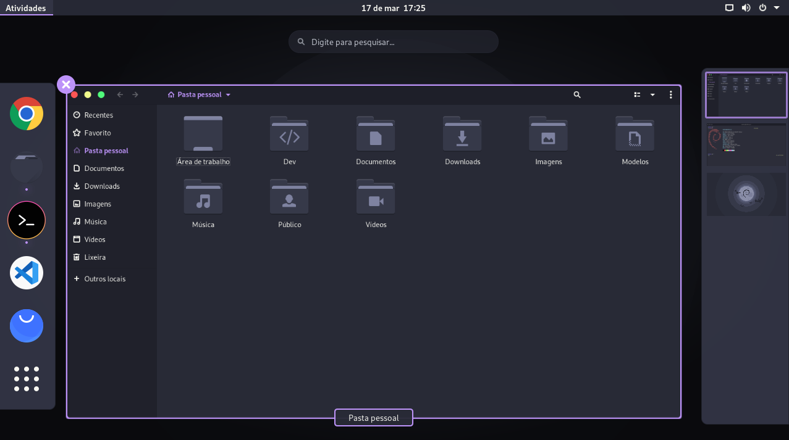

<h1 align="center">
   
  
   
  Dracula
   
</h1>

  <strong><a href="https://www.gtk.org/">GTK</a> dark theme</strong>

  <a href="#instalação">Instalação</a> •
  <a href="#time">Time</a> •
  <a href="#licença">Licença</a>

  

Este tema oferece suporte para ambientes de desktop baseados em GTK-3 e GTK-2, como Gnome, Unity, Budgie, Pantheon, XFCE, Mate, etc.

## Instalação

Todas as instruções podem ser encontradas em [INSTALL.md](./INSTALL.md)

## Time

 | 
--- | 
[Matheus Vitor](https://github.com/matheuuus) | 

## Licença

[GPL-3.0 License](./LICENSE.md)